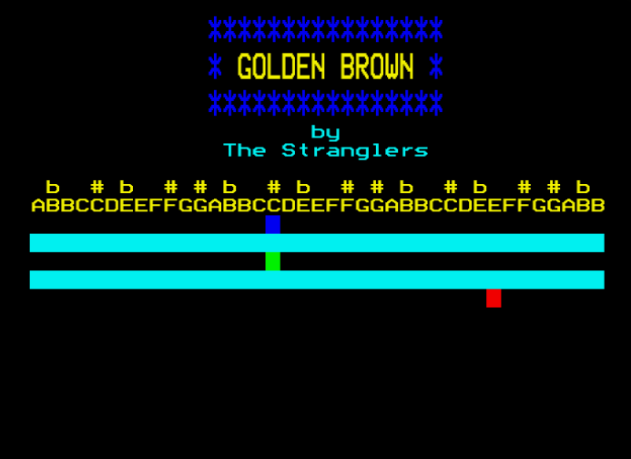

# Golden Brown - BBC BASIC Music Player

*Golden Brown* by The Stranglers (1981) is one of the stranger pop songs ever to chart: a waltz in an irregular compound time signature, built on a harpsichord.

Capturing it on a BBC Micro in BBC BASIC is an impressive piece of programming craft, especially considering it has:

- a three-voice sequencer with self-correcting timing
- a very smart note encoding scheme
- a very efficient visualisation of notes being played

All of it in under 60 lines of BASIC.

<p align="center">
  
</p>

---

## My Story

I was a 16 year old A-Level student studying Computer Science in the mid 1980s, at a time when the UK Government was pushing computer literacy in schools and running adult education programmes for those who had entered the workforce before the arrival of the microcomputer.

My Computer Science teacher ran one of these classes on a Saturday, using BBC Microcomputers from our school lab, and I became his assistant, helping to carry and set up the computers.

I remember one such Saturday, in between sessions at lunch break, my teacher slipped a 5¼" disc into a Cumana disc drive and loaded a program.  The disc whirred and after a slight pause, music.

What I heard amazed me - Golden Brown by the Stranglers, sounding like a harpsichord.

Escaping the program to halt its execution I typed `LIST` to see the programme behind the amazing sound.

I thought I understood the BBC Microcomputer and BBC BASIC pretty well but what I saw had me scratching my head. I could discern bits of the programme but I did not really understand how it generated the music and played it so well.

So it remained for many years, the memory occasionally resurfacing as I thought back on those days or more usually prompted by watching one of the many amazing _retro computing_ programs available on the likes of YouTube.

It was during one of these recollections that I went searching and happened across [this YouTube video](https://www.youtube.com/watch?v=oVD85-IGBDA) posted by [envanligfjant](https://www.youtube.com/@envanligfjant). It was Golden Brown on the BBC Micro!

With some excitement I saw it had a reference to [8-Bit Software - Issue 27 (1992, Richardson, C.J.)](https://8bs.nerdoftheherd.com/8BS27/). So I followed the links and it fired up in [jsbeeb](https://bbc.xania.org/).

There I was again, listening to Golden Brown playing out of a BBC (_emulated_) Micro and just like I did so many years ago at that adult education class I hit Escape and typed `LIST`.

I had the source code. Even better I have a disc image with it on. I extracted the BBC BASIC program and here it is as `goldenbrown.bas`.

The amazement has not diminished but with many years of experience behind me I now have understanding, and reverence.

---

## Analysis

The program is more sophisticated than it first appears:

- A three-voice sequencer with deadline-based timing that self-corrects every step.
- An encoding scheme where the score strings are keyboard tablature - each character is the key that would play that note.
- A real-time visualiser that costs two byte-writes per voice per frame.
- Direct pokes into the OS sound workspace to bypass queue delays.
- Two distinct envelope shapes that separate the voices in time even when they share the same pitch.

Every one of these is a small act of craft. None of them were necessary. All of them are there.

See [deep-dive.md](deep-dive.md) - it works through every line.

The source code extracted from the disc image had control characters embedded directly in the `PRINT` statements, which I've externalised as explicit `CHR$()` calls as these do not show well in a text editor or on GitHub. I also split some of the statements onto separate lines for clarity purposes, in particular the nested `FOR` loops. None of these changes affect execution.

---

## How to Run

Load `goldenbrown.bas` in your browser using the [jsbeeb online BBC Micro emulator](https://bbc.godbolt.org/):

1. Open [bbc.godbolt.org](https://bbc.godbolt.org/)
2. Use **File > Load BASIC** (or drag `goldenbrown.bas` onto the emulator window)
3. Type `RUN` and press Enter

---

## Who Wrote This?

There are no credits in the source code. For years the author was unknown.

Some detective work led me to the UK bulletin board [Stardot](https://www.stardot.org.uk) and [this post](https://www.stardot.org.uk/forums/viewtopic.php?p=386663#p386663):

```text
(J) Golden Brown - The Stranglers (BBC version by J.P. Cope)
```

One track amongst several on a disc image.

*Who is J.P. Cope?*

---

## Licensing

[](./LICENSE)
[](./LICENSE-docs.md)

- **Code**: [MIT License](./LICENSE)
- **Documentation**: [CC BY 4.0](./LICENSE-docs.md)
